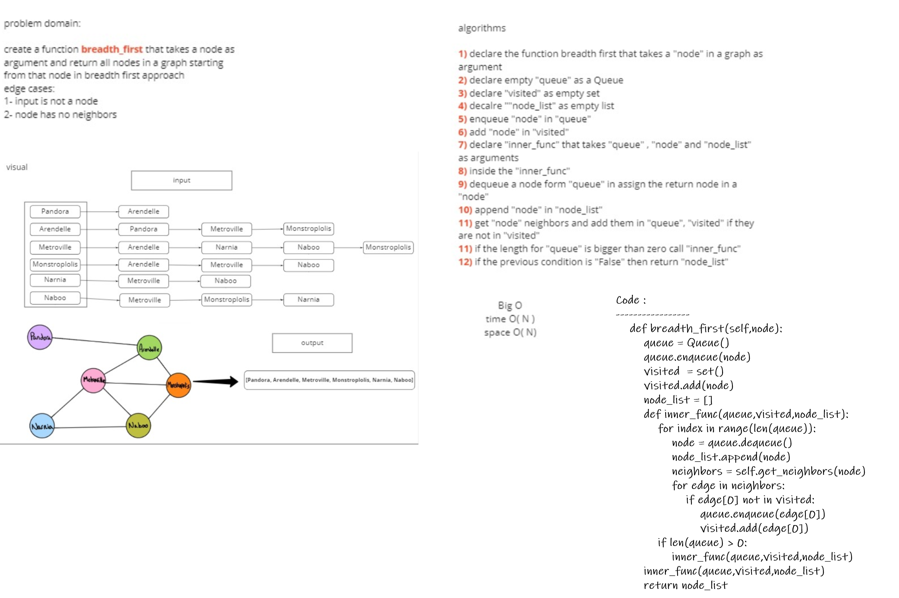

# Graphs

Ih this project, we created a data structure called **Graph** in Python. We used three classes, _Node_ and _Graph_.

**Node** included the following:

    1. `value`.

**Graph** included the following:

    _Attributes_:
         1. `adjacency_list`.

    _methods_:
        * `AddNode()`: Adds a new node to the graph, Takes in the value of that node, Returns the added node.
        * `AddEdge()`: Adds a new edge between two nodes in the graph, Include the ability to have a “weight”, Takes in the two nodes to be connected by the edge, Both nodes should already be in the Graph
        * `GetNodes()`: Returns all of the nodes in the graph as a collection (set, list, or similar)
        * `GetNeighbors()`: Returns a collection of edges connected to the given node, Takes in a given node, Include the weight of the connection in the returned collection
        * `Size()`: Returns the total number of nodes in the graph.
        * Gets nodes in breadth first approach

**User acceptance tests** are included with the following test cases:

_Graph_ test cases:

    Node can be successfully added to the graph
    An edge can be successfully added to the graph
    A collection of all nodes can be properly retrieved from the graph
    All appropriate neighbors can be retrieved from the graph
    Neighbors are returned with the weight between nodes included
    The proper size is returned, representing the number of nodes in the graph
    A graph with only one node and edge can be properly returned
    An empty graph properly returns null

#### breadth_first

## Challenge

- to return the graph nodes in breadth first approach

#### Efficiency for breadth first

- Time: O(N)
- Space: O(N)

## Solution

### to return all nodes after a specific node in a graph as breadth first approach then:

- use `graph.breadth_first(node)`
