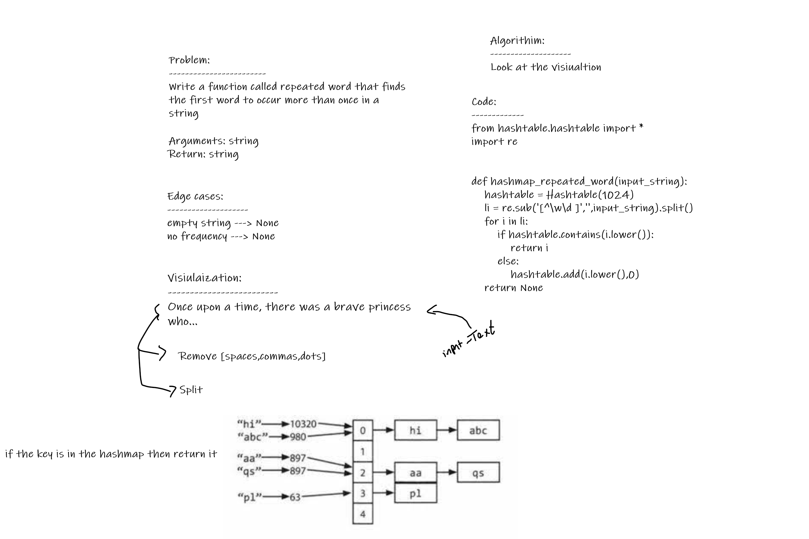

# Challenge Summary
Write a function called repeated word that finds the first word to occur more than once in a string

## Whiteboard Process

## Approach & Efficiency
time O(n)
space O(n)

## Solution
[hashmap_repeated_word](./hashmap_repeated_word.py)