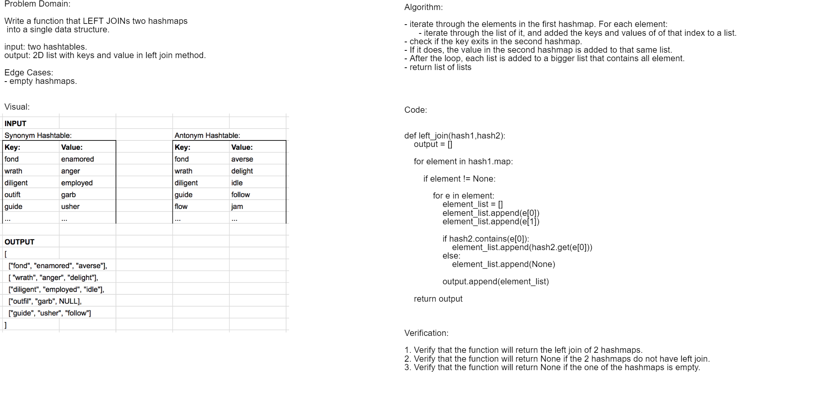

# Tree Intersection

## Challenge
Write a function that LEFT JOINs two hashmaps into a single data structure.

## Approach & Efficiency
Approach: first, I iterate through the elements in the first hashmap. For each element, I iterated through the list of it, and added the keys and values of of that index to a list. Then, checked if the key exits in the second hashmap. If it does, the value in the second hashmap is added to that same list. After the loop, each list is added to a bigger list that contains all element.  

* input: two hashtables.
* output: 2D list with keys and value in left join method.

## User acceptance Tests:
Test Cases `left_join`:
1. Verify that the function will return the left join of 2 hashmaps.
2. Verify that the function will return None if the 2 hashmaps do not have left join.
3. Verify that the function will return None if the one of the hashmaps is empty.

