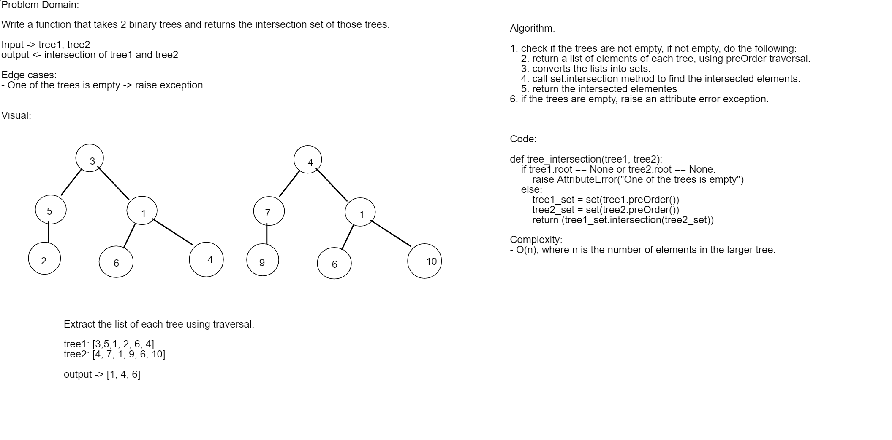

# Tree Intersection

## Challenge
Write a function called tree_intersection that takes two binary tree parameters.
Without utilizing any of the built-in library methods in Python, return a set of values found in both trees.

## Approach & Efficiency
Approach: first, I got a list of each input tree using preOrder traversal. Then, converted one list to a set and iterated through the other list, and checked if the element exists in the set. If it does, add to the output set.

Complexity: `O(n)`, where n is the number of elements in the larger tree.

## User acceptance Tests:
Test Cases `tree_intersection:
1. Verify that the function will return the intersected elements between two lists.
2. Verify that the function will return an empty set if the two lists have no intersection.
3. Verify that the function will raise an exception if one of the trees is empty.
4. Verify that the function will return the same tree if we compared the tree with itself.