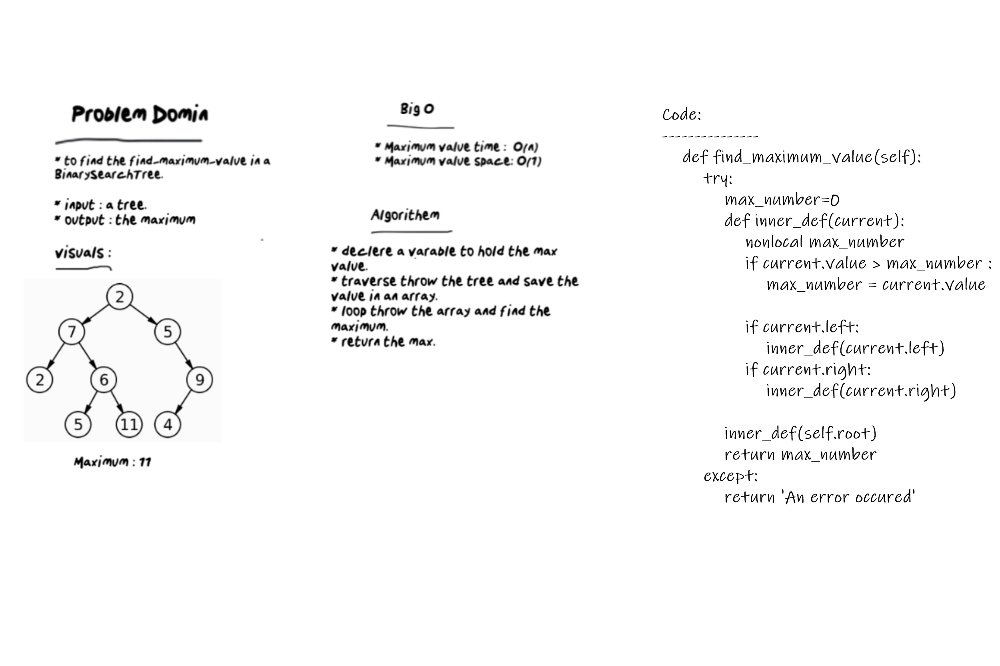
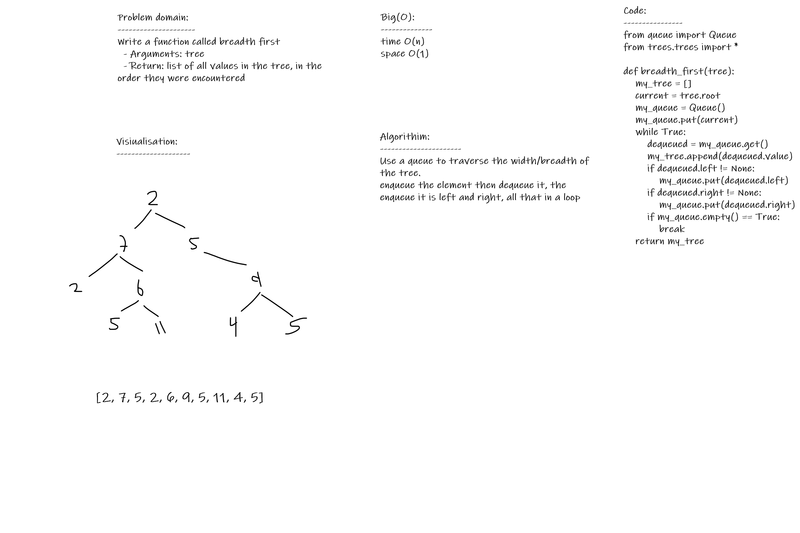
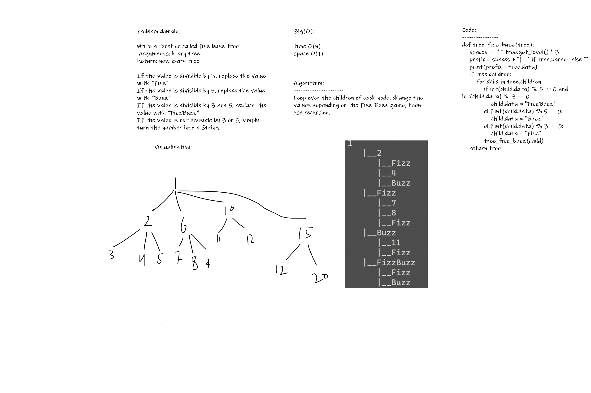

# Trees

A tree is a nonlinear data structure, compared to arrays, linked lists, stacks and queues which are linear data structures. A tree can be empty with no nodes or a tree is a structure consisting of one node called the root and zero or one or more subtrees.

## Challenge 15

- Create a Binary Search Tree that has Add and Contains methods
- Add
  - Arguments: value
  - Return: nothing
  - Adds a new node with that value in the correct location in the binary search tree.
- Contains
  - Argument: value
  - Returns: boolean indicating whether or not the value is in the tree at least once.

## Challenge 16

Write the following method for the Binary Tree class

- find maximum value
  - Arguments: none
  - Returns: number

Find the maximum value stored in the tree. You can assume that the values stored in the Binary Tree will be numeric.

## Challenge 17

Write a function called breadth first

- Breadth first
  - Arguments: tree
  - Return: list of all values in the tree, in the order they were encountered

## Challenge 18

Write a function called fizz buzz tree

- Tree FizzBuzz
  - Arguments: k-ary tree
  - Return: new k-ary tree

If the value is divisible by 3, replace the value with “Fizz”  
If the value is divisible by 5, replace the value with “Buzz”  
If the value is divisible by 3 and 5, replace the value with “FizzBuzz”  
If the value is not divisible by 3 or 5, simply turn the number into a String.

## Approach & Efficiency

### Depth First

- Depth first traversal is where we prioritize going through the depth (height) of the tree first. There are multiple ways to carry out depth first traversal, and each method changes the order in which we search/print the root. Here are three methods for depth first traversal:

- Pre-order: root >> left >> right
- In-order: left >> root >> right
- Post-order: left >> right >> root

### Big O in Trees

- The Big O time complexity of a Binary Search Tree’s insertion and search operations is O(h), or O(height). In the worst case, we will have to search all the way down to a leaf, which will require searching through as many nodes as the tree is tall. In a balanced (or “perfect”) tree, the height of the tree is log(n). In an unbalanced tree, the worst case height of the tree is n.
- Find max value: time O(n) / space O(1)
- Tree breadth first: time O(n) / space O(1)
- Tree FizzBuzz : time O(n) / space O(1)

### Binary Search Trees

A Binary Search Tree (BST) is a type of tree that does have some structure attached to it. In a BST, nodes are organized in a manner where all values that are smaller than the root are placed to the left, and all values that are larger than the root are placed to the right.

## API

- Pre-order: root >> left >> right
- In-order: left >> root >> right
- Post-order: left >> right >> root
- Add
  - Arguments: value
  - Return: nothing
  - Adds a new node with that value in the correct location in the binary search tree.
- Contains
  - Argument: value
  - Returns: boolean indicating whether or not the value is in the tree at least once.
- Find maximum value
  - Arguments: none
  - Returns: number
- Tree breadth first
  - Arguments: tree
  - Return: list of all values in the tree, in the order they were encountered
- Tree FizzBuzz
  - Arguments: k-ary tree
  - Return: new k-ary tree  
    If the value is divisible by 3, replace the value with “Fizz”  
    If the value is divisible by 5, replace the value with “Buzz”  
    If the value is divisible by 3 and 5, replace the value with “FizzBuzz”  
    If the value is not divisible by 3 or 5, simply turn the number into a String.

## Whiteboard Process

Find maximum value  

Tree breadth first

Tree FizzBuzz

