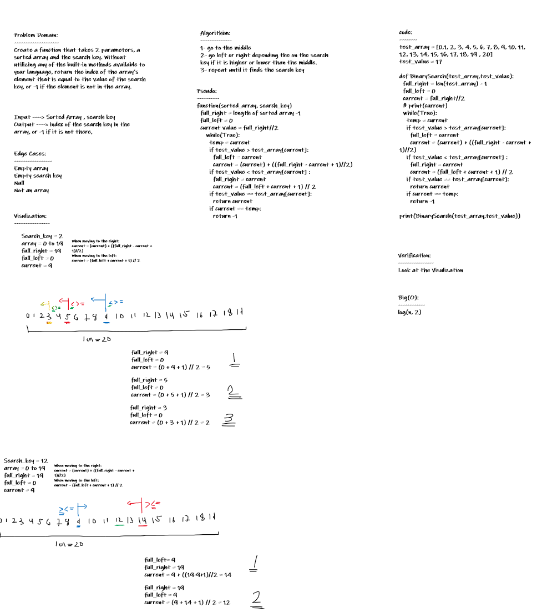

# Insert to Middle of an Array

<!-- Description of the challenge -->

Create a function that takes 2 parameters, a sorted array and the search key. Without utilizing any of the built-in methods available to your language, return the index of the array’s element that is equal to the value of the search key, or -1 if the element is not in the array.

## Whiteboard Process

<!-- Embedded whiteboard image -->

## Approach & Efficiency

<!-- What approach did you take? Discuss Why. What is the Big O space/time for this approach? -->

I used the Binary Search , it saves time, and less for loops.  
Time Complexity = O(log(n,2))   
