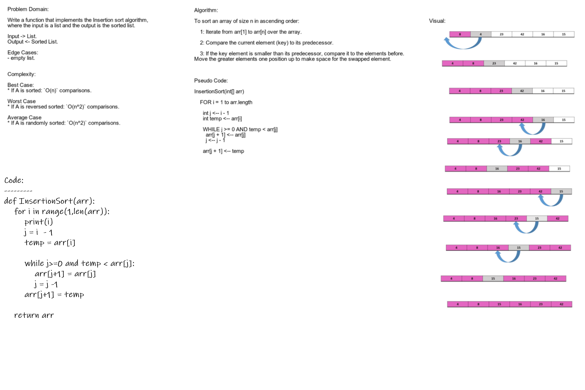

# Challenge Summary

### Write a function that use inserting sort for sort a list of number

## Whiteboard Process

## Approach & Efficiency

O(n\*n)

## Solution

[code](https://github.com/Abdullah-AlSawalmeh/data-structures-and-algorithms/blob/main/challenges/challenges/insertion_sort.py)

[test code](https://github.com/Abdullah-AlSawalmeh/data-structures-and-algorithms/blob/main/challenges/tests/test_challenges.py)

[Blog](https://github.com/Abdullah-AlSawalmeh/data-structures-and-algorithms/blob/main/challenges/challenges/whiteboards/insertion_sort_article.md)
