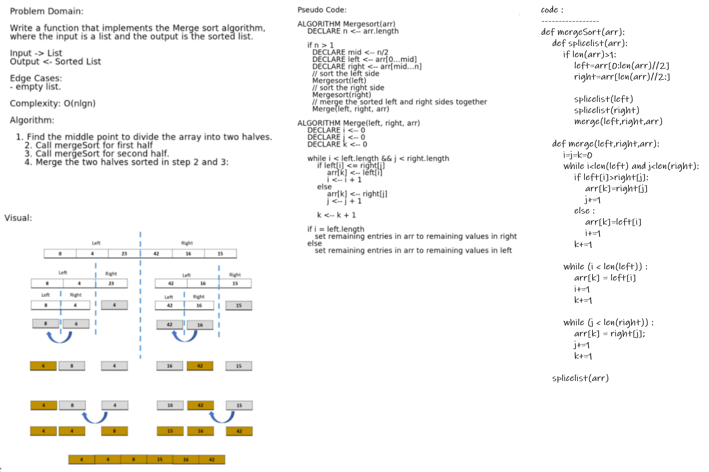

# Challenge Summary

### Write a function that use Merging Sort for sort a list of number

## Whiteboard Process

## Approach & Efficiency

O(nlogn)

## Solution

[code](https://github.com/Abdullah-AlSawalmeh/data-structures-and-algorithms/blob/main/challenges/challenges/merge_sort.py)

[test code](https://github.com/Abdullah-AlSawalmeh/data-structures-and-algorithms/blob/main/challenges/tests/test_challenges.py)

[Blog](https://github.com/Abdullah-AlSawalmeh/data-structures-and-algorithms/blob/main/challenges/challenges/whiteboards/merge_sort_article.md)
