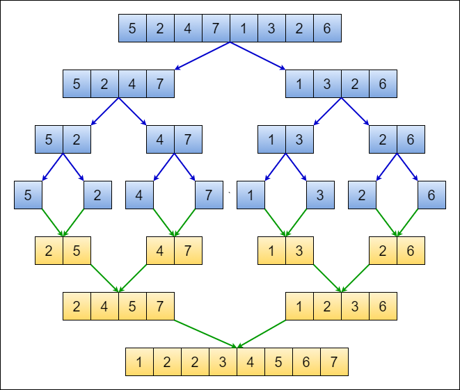

```
arr = [9,4,23,42,16,15]  
n = len(arr) = 6  
if n > 1: True   
    mid = n/2 = 3  
    left = [0:3] = [9,4,23]  
    right = [3:] = [42,16,15]  
    // sort the left side  
        arr = [9,4,23]  
        n = len(arr) = 3  
        if n > 1 : True  
            mid = n/2 = 1  
            left = [0:1] =  [9]  
            right = [1:] = [4,23]  
            // sort the left side  
                arr = [9]  
                n = len(arr) = 1  
                if n > 1 : False  
            // sort the right side  
                arr = [4,23]  
                n = len(arr) = 2  
                if n > 1 : True  
                    mid = n/2 = 1  
                    left = [0:1] =  [4]  
                    right = [1:] = [23]  
                    // sort the left side  
                    False  
                    // sort the right side  
                    False  
                    // merge the sorted left and right sides together  
                    Merge(left=[4], right=[23], arr=[4,23])  
                        i = 0  
                        j = 0  
                        k = 0  
                        while i < len(left) = 1 and j < len(right) = 1: True
                            if left[i=0]=4 <= right[j=0]=23: True
                                arr[k=0] = left[i=0]
                                i = i + 1 = 1
                                OUT OF THE LOOP 
                                [4,23]
                        k = k +1 = 1
                        if i = 1 == len(left=)= 1 :
                            arr = [4,23]
            // merge the sorted left and right sides together
            left = [0:1] =  [9]
            right = [1:] = [4,23]
            Merge(left=[9], right=[4,23], arr=[9,4,23])
            i = 0
            j = 0
            k = 0
            while i < len(left) = 1 and j < len(right) = 2: True
                if left[i=0]=9 <= right[j=0]=4: False
                else:
                    arr[k] = right[j]  ==> [4,9,23]
                    j = j +1 = 1
            Loop: while i < len(left) = 1 and j < len(right) = 2: True
                if left[i=0]=4 <= right[j=1]=9: TRUE
                    arr[k=0] = left[i=0]
                    i = i + 1 = 1
                    OUT OF THE LOOP 
                    [4,9,23]
            k = k +1 = 1
            if i = 1 == len(left=)= 1 :
                arr = [4,9,23]
    // sort the Right side
        Do all the steps above, then merge, then sort.
```


