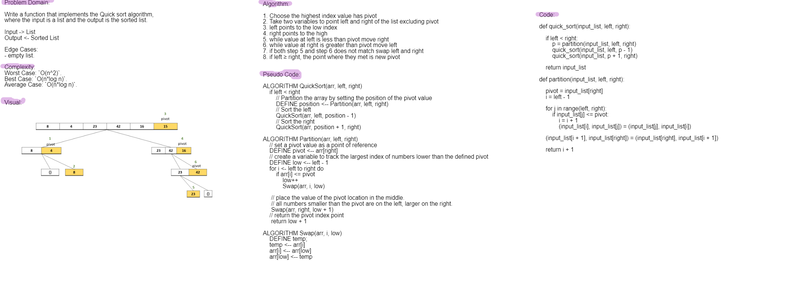

# Quick Sort
Implement quick sort algorithm.

## Challenge
Write a function that implements the Quick sort algorithm, where the input is a list and the output is the sorted list.

## Approach & Efficiency
Approach: I followed these steps: 
1. Choose the highest index value has pivot
2. Take two variables to point left and right of the list excluding pivot
3. left points to the low index
4. right points to the high
5. while value at left is less than pivot move right
6. while value at right is greater than pivot move left
7. if both step 5 and step 6 does not match swap left and right
8. if left ≥ right, the point where they met is new pivot

## Complexity: 
Worst Case: `O(n^2)`.
Best Case: `O(n*log n)`.
Average Case: `O(n*log n)`.

## Solution

## Solution

[code](https://github.com/Abdullah-AlSawalmeh/data-structures-and-algorithms/blob/main/challenges/challenges/quick_sort.py)

[test code](https://github.com/Abdullah-AlSawalmeh/data-structures-and-algorithms/blob/main/challenges/tests/test_challenges.py)

[Blog](https://github.com/Abdullah-AlSawalmeh/data-structures-and-algorithms/blob/main/challenges/challenges/whiteboards/quick_sort_article.md)