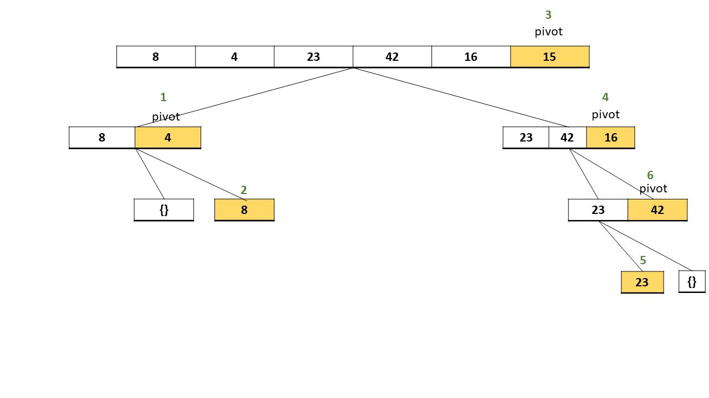

# Quick Sort

Quicksort is an algorithm based on divide and conquer approach in which the array is split into sub-arrays and these sub-arrays are recursively called to sort the elements.

## Problem Domain:
Write a function that implements the Quick sort algorithm, where the input is a list and the output is the sorted list.

## Algorithm
To sort an array of size n in ascending order:

1. Choose the highest index value has pivot
2. Take two variables to point left and right of the list excluding pivot
3. left points to the low index
4. right points to the high
5. while value at left is less than pivot move right
6. while value at right is greater than pivot move left
7. if both step 5 and step 6 does not match swap left and right
8. if left ≥ right, the point where they met is new pivot

## Pseudo Code:
```
ALGORITHM QuickSort(arr, left, right)
    if left < right
        // Partition the array by setting the position of the pivot value 
        DEFINE position <-- Partition(arr, left, right)
        // Sort the left
        QuickSort(arr, left, position - 1)
        // Sort the right
        QuickSort(arr, position + 1, right)

ALGORITHM Partition(arr, left, right)
    // set a pivot value as a point of reference
    DEFINE pivot <-- arr[right]
    // create a variable to track the largest index of numbers lower than the defined pivot
    DEFINE low <-- left - 1
    for i <- left to right do
        if arr[i] <= pivot
            low++
            Swap(arr, i, low)

     // place the value of the pivot location in the middle.
     // all numbers smaller than the pivot are on the left, larger on the right. 
     Swap(arr, right, low + 1)
    // return the pivot index point
     return low + 1

ALGORITHM Swap(arr, i, low)
    DEFINE temp;
    temp <-- arr[i]
    arr[i] <-- arr[low]
    arr[low] <-- temp
```

## Trace (Visual):
#### Input: [8,4,23,42,16,15]



## Time Complexity:
Worst Case: `O(n^2)`.
Best Case: `O(n*log n)`.
Average Case: `O(n*log n)`.

## Space Complexity
`O(log n)`.